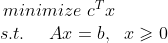

# LP Solver

This is a Linear Programming solver based on the Primal-Dual Interior point method written in C++

## Building

Make sure you have the these libraries before building the package:
<ul>
 <li> Armadillo
 <li> Openblas
 <li> Lapack
</ul>

## Usage
The linear programming problem can be defined in the standard form as:<br/>


 This standard form can be encoded in our code as:

 ```c++
LPproblem problem = LPproblem(A, b, c);
```

To get the minimum optimum result for the problem:<br/>

```c++
LPresult result = problem.minimize();
```

If instead you want to maximize the objective function, c can be replaced with -c

The result is stored using the class LPresult with contains a bool indicating whether the optimization was successful or not, the optimized value, the vector x which optimizes the objective function.
```c++
  if(result.success){
        cout<<"Operation terminated successfully!\n";
        cout<<"Vector x which minimizes objective function is:\n";
        cout<<result.x;
        cout<<"Optimum value for objective function is: "<<result.opt_val<<"\n";
  }
  else{
      cout<<"Operation did not terminate.\n";
  }
  ```

  Look at main.cpp for an example problem.
  ## Algorithm

  [Primal-Dual interior point method based on Newton's method](https://ocw.mit.edu/courses/sloan-school-of-management/15-084j-nonlinear-programming-spring-2004/lecture-notes/lec14_int_pt_mthd.pdf) has been used to solve the optimization problem.
